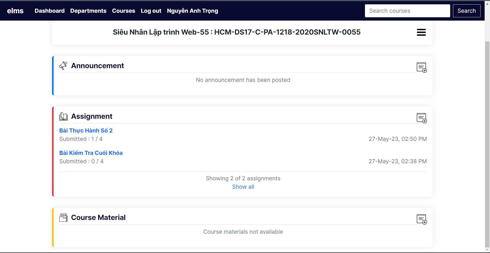

# Hệ thống quản lý e-learning

Một website quản lý học tập và hệ thống đánh giá trực tuyến cho giáo dục học thuật.

## Features

- Quản trị viên thêm các khóa học, giáo viên và sinh viên và chỉ định các khóa học cho họ.
- Giáo viên tạo nội dung khóa học, thông báo, bài tập, câu hỏi, điểm danh, v.v. Giáo viên có thể xem chi tiết và phân tích các đánh giá.
- Sinh viên có thể đăng ký các khóa học bằng khóa truy cập, xem nội dung khóa học của các khóa học đã đăng ký, tham gia đánh giá và xem chi tiết kết quả của họ.
- Phần thảo luận cho cả giáo viên và học sinh.


## Tech Stack

1. Django 4.0.4
2. Bootstrap 5.0.2
3. jQuery 3.6.0
4. Chart.js v3.9.1
5. Animate.css 4.1.1


## Run Locally

1. Install dependencies

```bash
pip install -r requirements.txt
```

> **Note:** Nếu bạn đang sử dụng các phiên bản mới hơn của python (3.10+), bạn có thể cần thêm tùy --use-deprecated=legacy-resolverchọn khi cài đặt các phụ thuộc pipđể tránh lỗi:\:

```bash
pip install -r requirements.txt --use-deprecated=legacy-resolver
```

2. Make migrations and migrate

```bash
python manage.py makemigrations
```

```bash
python manage.py migrate
```

3. Create admin/superuser

```bash
python manage.py createsuperuser
```

4. Finally run the project

```bash
python manage.py runserver
```

Now the project should be running on http://127.0.0.1:8000/

Đăng nhập với tư cách quản trị viên và thêm một số khóa học, giáo viên và học sinh.

Demo : https://drive.google.com/file/d/1ZCDXNvIYvkWAIVriLrwpQwZz5S1cLTEM/view?usp=sharing

## Ảnh demo





